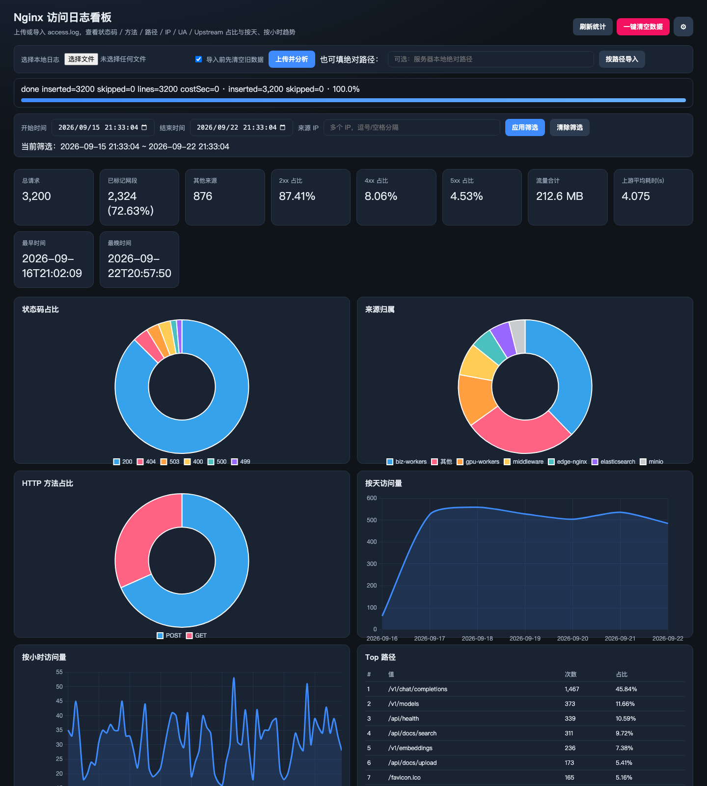

# Nginx Log Analyzer

[English](README.md) | **中文**

把 nginx `access.log` 解析入库到 MySQL，并用本地 Web 看板做流量分析。适合排障、容量观察、异常 IP / 路径排查。

**作者：** [JustinYi922](https://github.com/JustinYi922/nginx-log-analyzer) · **邮箱：** 635344900@qq.com  
**协议：** [MIT](LICENSE) · **商用与署名：** 见 [COMMERCIAL.md](COMMERCIAL.md)  
**仓库：** https://github.com/JustinYi922/nginx-log-analyzer

## 功能

### 日志导入

- **浏览器上传**：选择 `.log` / `.txt`，可选清空旧数据后导入（推荐）
- **绝对路径导入**：服务器本机已有大文件时，直接指定路径解析
- **大批量友好**：按批写入 MySQL（默认 2000 行/批），上传上限约 2GB
- **进度条**：导入过程可轮询进度，避免大文件“假死”
- **一键清空**：页面或 API 清空表，方便换一份日志重新分析

### 解析字段

常见 combined 风格 access log，并尽量带上 upstream 相关字段，入库后可按维度聚合：

| 字段 | 用途示例 |
|------|----------|
| remote_addr / x_forwarded_for | 来源 IP、代理链 |
| access_time | 时间筛选、按天/小时趋势 |
| method / path / protocol | 接口与路径热点 |
| status / body_bytes | 成功/失败占比、流量体量 |
| referer / user_agent | 来源页、客户端分布 |
| upstream_addr / upstream_response_time | 上游节点与耗时 |

格式不完全一致时，可改 `NginxAccessLogParser`，或提 Issue 并附上脱敏样例行。

### Web 看板

深色单页看板（Chart.js 已内置，内网无需外网 CDN），打开即可用，无需单独前端工程：

- **概览卡片**：总请求量、已标记网段占比、2xx / 4xx / 5xx 占比
- **状态码占比**、**HTTP 方法占比**（饼图）
- **来源归属**：按配置的 IP 标签汇总
- **按天 / 按小时访问量**（折线）
- **Top 路径 / 来源 IP / User-Agent / Upstream** 排行表
- **筛选**：时间范围 + 多 IP（逗号/空格分隔）；默认最近一周

#### 界面示例

演示数据（`docs/examples/sample-access.log`，3200 行）+ IP 角色标签：


图表与 Top 路径：



### MySQL 与运维

- 页面齿轮 **MySQL 设置**：Host / Port / Database / User / Password
- **测试连接** → **保存并切换**，配置写入 `~/.nginx-log-analyzer/db.json`（不进仓库）
- 首次连接时可自动建库建表（也可手动 `CREATE DATABASE`）
- 默认端口 `8099`，本机打开 http://127.0.0.1:8099/

### IP 网段标签（可选）

按来源 IP 映射到系统角色，配置见 [`docs/examples/ip-labels.yml`](docs/examples/ip-labels.yml)，或写入 `application.yml`：

```yaml
nginx-log:
  ip-labels:
    - label: biz-workers
      ranges:
        - 10.170.24.125-10.170.24.136
    - label: middleware
      ranges:
        - 10.170.24.137-10.170.24.139
    - label: elasticsearch
      ranges:
        - 10.170.24.140-10.170.24.142
    - label: edge-nginx
      ranges:
        - 10.170.24.143-10.170.24.144
    - label: minio
      ranges:
        - 10.170.24.145-10.170.24.146
    - label: gpu-workers
      ranges:
        - 10.170.68.61-10.170.68.65
```

支持：精确 IP、前缀（`10.0.0.`）、区间（`a.b.c.d-a.b.c.e`）。

### 其它

- Java 8+ / Spring Boot，单 jar 可跑
- **Windows 快捷下载**：仓库 [`dist/nginx-log-analyzer-windows.zip`](dist/nginx-log-analyzer-windows.zip)（含 jar + `start.bat`），解压即用
- 提供 REST API（导入、进度、统计、库配置），可脚本化接入
- 单元测试覆盖解析与 IP 标签逻辑；GitHub Actions CI 跑 `mvn test`

## 环境要求

- Java 8 或更高
- MySQL 5.7+ / 8.x
- Maven 3.6+（仅从源码构建时需要）

## 快速开始

### 0. Windows 快捷下载（推荐，免编译）

1. 下载 [`dist/nginx-log-analyzer-windows.zip`](dist/nginx-log-analyzer-windows.zip)
2. 解压到任意目录（内含 `nginx-log-analyzer.jar` 与 `start.bat`）
3. 本机已安装 **Java 8+** 与 **MySQL** 后，双击 `start.bat`
4. 浏览器会打开 http://127.0.0.1:8099/ ，在页面齿轮里配置数据库即可

无需安装 Maven，也无需从源码打包。

### 1. 准备 MySQL

可先建空库（也可用页面「保存并切换」时自动创建）：

```sql
CREATE DATABASE nginx_log DEFAULT CHARACTER SET utf8mb4;
```

### 2. 配置

编辑 `src/main/resources/application.yml`，或启动后在页面齿轮里填库连接。

### 3. 源码运行

```bash
mvn spring-boot:run
```

打开 http://127.0.0.1:8099/

### 4. 或打包运行

```bash
mvn -DskipTests package
java -jar target/nginx-log-analyzer-0.1.0-SNAPSHOT.jar
```

## 导入日志

**演示样例：** `docs/examples/sample-access.log`（合成数据）。可在页面上传，或：

```bash
curl -X POST http://127.0.0.1:8099/api/import \
  -H 'Content-Type: application/json' \
  -d '{"filePath":"'$(pwd)'/docs/examples/sample-access.log","truncate":true}'
```

**上传（推荐）：** 页面选择文件 → 可选清空 → **Upload & analyze**。

**按绝对路径：**

```bash
curl -X POST http://127.0.0.1:8099/api/import \
  -H 'Content-Type: application/json' \
  -d '{"filePath":"/path/to/access.log","truncate":true}'
```

**清空全部数据：**

```bash
curl -X POST http://127.0.0.1:8099/api/clear
```

导入进度：`GET /api/import/progress`

## 支持的日志格式

Combined 风格 nginx access log，可带常见扩展字段，例如：

```text
$remote_addr - $remote_user [$time_local] "$request" $status $body_bytes_sent
"$http_referer" "$http_user_agent" "$http_x_forwarded_for"
"$upstream_addr" $upstream_response_time
```

若格式不同，请调整 `NginxAccessLogParser`，或提 Issue 并附脱敏样例行。

## IP 标签（可选）

见上文「IP 网段标签」与 [`docs/examples/ip-labels.yml`](docs/examples/ip-labels.yml)。

## API 一览

| Method | Path | Description |
|--------|------|-------------|
| GET | `/api/db/config` | 当前库配置（密码脱敏） |
| POST | `/api/db/test` | 测试连接 |
| POST | `/api/db/apply` | 保存并切换数据源 |
| POST | `/api/import` | 按文件路径导入 |
| POST | `/api/import/upload` | 上传导入 |
| GET | `/api/import/progress` | 导入进度 |
| POST | `/api/clear` | 清空表 |
| GET | `/api/stats` | 聚合统计（时间、IP、limit） |
| GET | `/api/stats/overview` | 概览卡片指标 |

## 目录结构

```text
dist/nginx-log-analyzer-windows.zip  Windows 预打包（jar + start.bat）
src/main/java/com/gwamcc/nginxlog/   Java 源码
src/main/resources/static/           看板（index.html）
src/main/resources/db/schema.sql     表结构
src/test/java/                       单元测试
.github/workflows/ci.yml             CI
COMMERCIAL.md                        商用与署名说明
README.md                            英文 README（默认）
docs/screenshots/                    看板截图示例
start.bat                            Windows 启动脚本（与 zip 内同款）
```

## 协议与商用

- 开源协议：[LICENSE](LICENSE)（MIT）
- 商用署名与邮件告知：[COMMERCIAL.md](COMMERCIAL.md)、[NOTICE](NOTICE)

## 贡献

见 [CONTRIBUTING.md](CONTRIBUTING.md)。欢迎 Issue 与 Pull Request。

## 作者与联系

- GitHub: https://github.com/JustinYi922/nginx-log-analyzer
- Email: 635344900@qq.com

## 免责声明

仅用于你有权访问的系统日志分析。请勿将真实生产日志、数据库密码提交到公开仓库。
